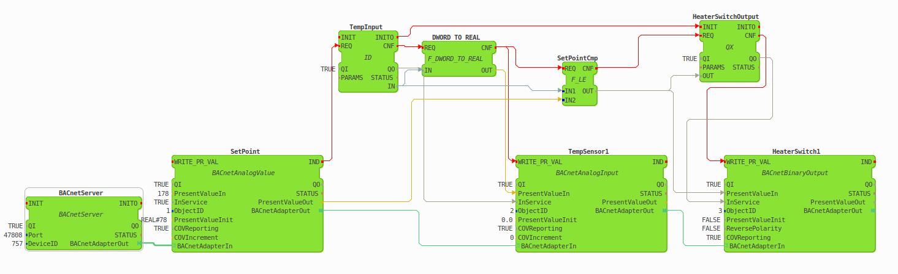

# BACnet Server Module for Eclipse 4diac

This code represents a BACnet/IP Server module for [Eclipse 4diac](https://www.eclipse.org/4diac/), which was developed throughout the course writing bachelor's thesis at the TU Vienna.

This module is based on the functions provided by the [BACnet Stack library](http://bacnet.sourceforge.net/).

Main features:
+ Allows initializing BACnet devices consisting of an arbitrary number of Analog/Binary Value/Input/Output BACnet objects using daisy-chained Configuration FBs.
+ PresentValue properties of the above-named objects can be read/written either via BACnet the ReadProperty/WriteProperty service request or via the output/input interface of the Configuration FB
+ Supports Who-Is/I-Am service requests 
+ Supports SubscribeCOV service requests and allows remote BACnet devices to subscribe for Unconfirmed Change-of-Value (COV) notifications of the mentioned objects.
+ Runs BACnet related operations in a new execution thread.

Tested on:
+ Ubuntu 18.04.5 LTS
+ Raspberry Pi 2 running Raspbian Stretch
+ Raspberry Pi 4 running Raspbian Buster

## Compiling 4diac FORTE with BACnet Server module 
### Compiling for a Linux PC using cmake
1. Create a folder for forte's external module (e.g., 'external_modules') and clone this repo into it by executing 'git clone https://github.com/alexandertepaev/forte_bacnet_server_dev.git'
2. Download the [BACnet protocol stack 0.8.6](https://sourceforge.net/projects/bacnet/files/bacnet-stack/bacnet-stack-0.8.6/) and unpack it.
3. Compile the BACnet protocol stack library by executing 'make' command in its root folder.
4. Download [4diac FORTE 1.12.0 sources](https://www.eclipse.org/downloads/download.php?file=/4diac/releases/1.12/forte/forte-incubation_1.12.0.zip) and unpack it.
5. Now configure 4diac FORTE from source using cmake as described in [this](https://www.eclipse.org/4diac/en_help.php?helppage=html/installation/install.html) documentation article. When generating Makefiles, make sure you set CMAKE_BUILD_TYPE to 'Debug', FORTE_ARCHITECTURE to Posix, check the FORTE_MODULE_IEC61131 modules and set the FORTE_EXTERNAL_MODULES_DIRECTORY to the directory created in Step 1.
6. After hitting the 'configure' button, check the FORTE_MODULE_BAcnetServer box. Hit 'Configure'.
7. Provide cmake with a path to the root folder of the BACnet Stack library from Step 2.
8. Hit 'configure' + 'generate'
9. Switch to folder with the build and execute 'make' command there
10. Run forte using ./forte

### Crosscompiling for the Raspbian Buster
TODO

## Adding BACnet Server function blocks into the 4diac IDE
1. Download and start [4diac IDE](https://www.eclipse.org/4diac/en_dow.php), it will ask you to choose the workspace directory.
2. After choosing or creating a new workspace directory, copy the 'bacnet_server_fb_type_definitions' folder found in the root of this project into the workspace folder.
3. Start 4diac IDE, BACnet server function block can be now found in the FB Palette. 

## Example BACnet Server IEC 61499 Application

This figure should provide an example of how a simple BACnet IEC 61499 application is built. It is a simple On/Off controller, which has one input (temperature sensor), one output (heater switch), and one
pure software data point - a setpoint. All three data points are wrapped by BACnet objects. BACnet server and its corresponding objects are initialized and configured in a daisy-chained manner. The controller is not executed periodically, but only when the PresentValue property of the AnalogValue object is changed.

### TODOs
+ Static client controller varialbe -> ATM only one server per one IEC 61499 application;
+ Duplicate code in object config fbs and bacnet object fbs. -> decorator pattern / more abstraction
+ OutOfService for input/output objects is not implemented yet.
+ BACnet Stack lib wrapper + Combine With BACnet Client into BACnet Device.